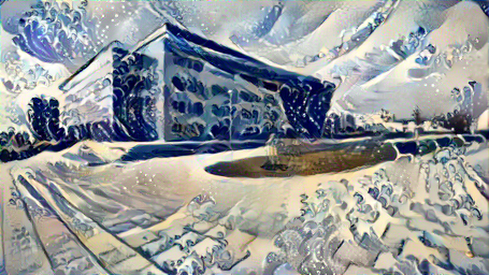
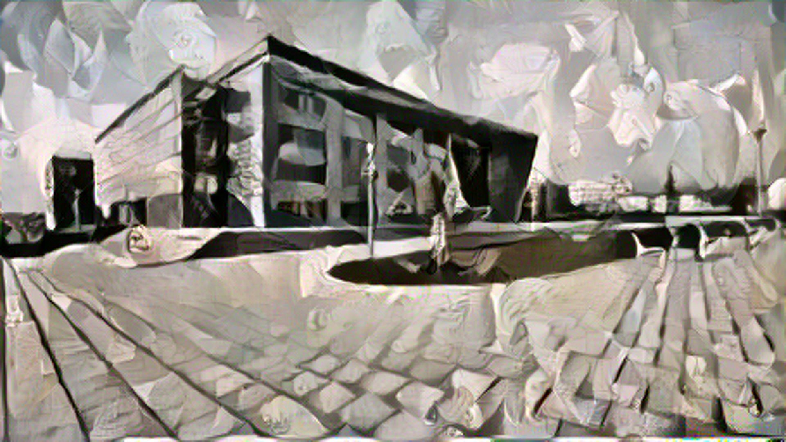
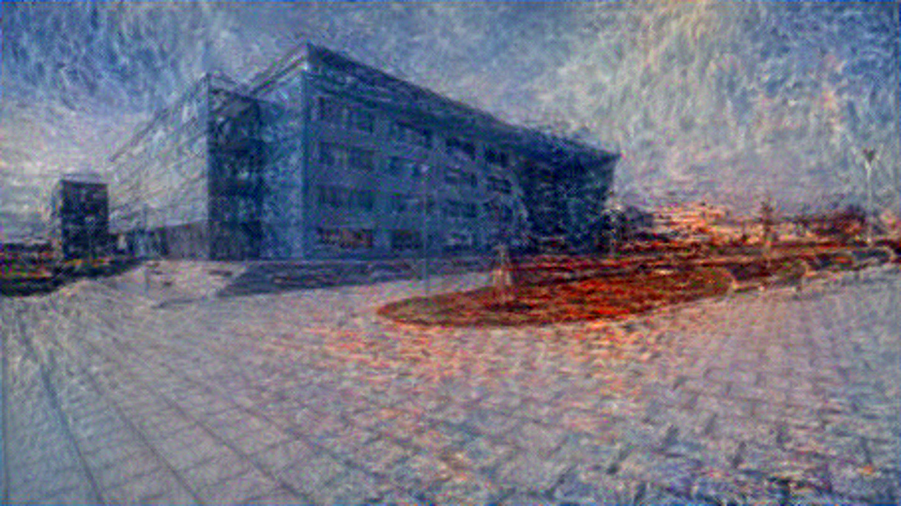

# Neural Style Transfer
In this repository, the Neural Style Transfer algorithm implementation will be stored (https://arxiv.org/abs/1508.06576). 
I used Python and PyTorch to implement the algorithm. The code is written to be as simple and understandable as possible;
also, there are lots of comments, so it should be pretty clear.

## Implementation progress
- [x] Preprocessing, deprocessing, visualization
- [x] VGG19 model feature extraction
- [x] Content, style loss, gram matrix
- [x] Training loop
- [ ] Refactoring
- [ ] Optimizing
- [ ] Documentation
- [ ] Testing, tweaking, experimenting

## Used paintings
Neither the content images or style paintings are in the repository so far, because I want to avoid citation hell as long
as possible. After I write the paper, I will include the images and their sources. So far, here's the list of the paintings:

- The Starry Night, Vincent van Gogh
- The Great Wave off Kanagawa, Hokusai
- Guernica, Pablo Picasso
- Houses of Parliament, Claude Monet
- The Boat, Pierre August Renoir
- Port de Peche, Maurice de Vlaminck
- The Persistence of Memory, Salvador Dali

## The results so far
As a content image, I used this photo of my faculty building, taken from Mapy.cz
(https://d48-a.sdn.cz/d_48/c_img_G_C/1Mrp8w.jpeg). As a style images, I used The Starry Night, 
The Great Wave off Kanagawa, Guernica and Houses of Parliament. The results are in the `results` folder and here ;)

