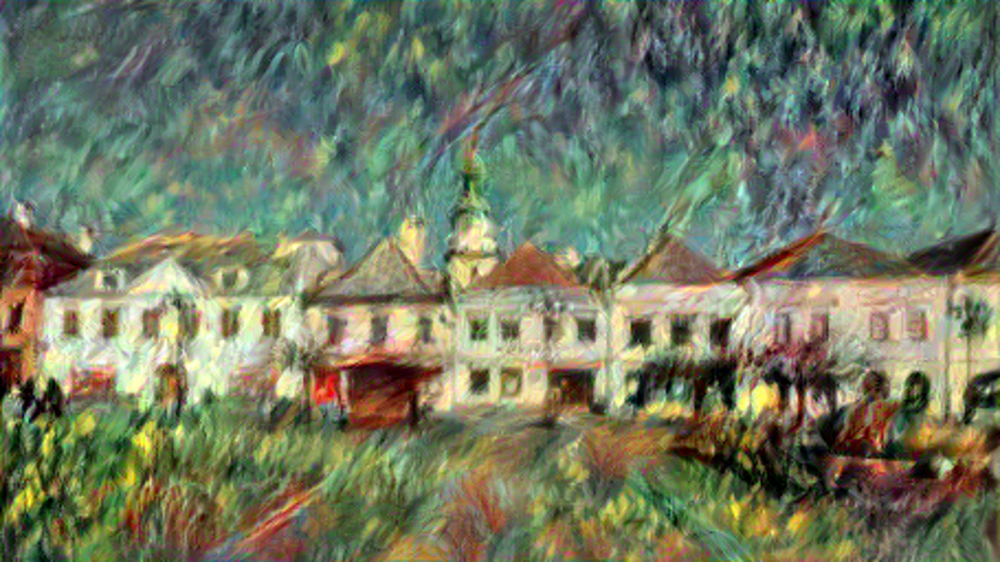

# Neural Style Transfer
In this repository, the Neural Style Transfer algorithm implementation will be stored (https://arxiv.org/abs/1508.06576). 
I used Python and PyTorch to implement the algorithm. The code is written to be as simple and understandable as possible;
also, there are lots of comments, so it should be pretty clear.

## Implementation progress
- [x] Preprocessing, deprocessing, visualization
- [x] VGG19 model feature extraction
- [x] Content, style loss, gram matrix
- [x] Training loop
- [x] Refactoring
- [x] Optimizing
- [x] Documentation
- [x] Testing, tweaking, experimenting
- [x] Style mashup
- [ ] More model backends?
- [ ] FastNST?

## Used paintings
I selected a few paintings from the WikiArt database to use as style images. I made sure the images are public domain,
so they can be used freely. The images of matching dimensions are stored in the ```images/style``` directory, the 
ones that need to be resized using ```--force_resize True``` are in the ```images/other``` directory. The images are:

- [The Starry Night, Vincent van Gogh](https://www.wikiart.org/en/vincent-van-gogh/the-starry-night-1889)
- [The Great Wave off Kanagawa, Hokusai](https://www.wikiart.org/en/katsushika-hokusai/the-great-wave-of-kanagawa-1831)
- [Houses of Parliament, Claude Monet](https://www.wikiart.org/en/claude-monet/houses-of-parliament)
- [The Skiff, Pierre-Auguste Renoir](https://www.wikiart.org/en/pierre-auguste-renoir/the-skiff-1880)
- [Village on the River, Maurice de Vlaminck](https://www.wikiart.org/en/maurice-de-vlaminck/village-on-the-river-1915)
- [Yellow-Red-Blue, Wassily Kandinsky](https://www.wikiart.org/en/wassily-kandinsky/yellow-red-blue-1925)
- [The Burning of the Houses of Parliament, J.M.W. Turner](https://www.wikiart.org/en/william-turner/the-burning-of-the-houses-of-parliament-3)
- [The Wreck of a Transport Ship, Joseph Mallord William Turner](https://www.wikiart.org/en/william-turner/the-wreck-of-a-transport-ship)
- [Ad Parnassum, Paul Klee](https://www.wikiart.org/en/paul-klee/to-the-parnassus-1932)
- [Choppy Sea, Jules Dupre](https://www.wikiart.org/en/jules-dupre/choppy-sea-1870)

## The results so far
As a content image, I used [this](https://d48-a.sdn.cz/d_48/c_img_G_C/1Mrp8w.jpeg) photo of my faculty building, 
taken from Mapy.cz, and [this](https://cs.wikipedia.org/wiki/Brunt%C3%A1l#/media/Soubor:Brunt%C3%A1l,_n%C3%A1m%C4%9Bst%C3%AD_M%C3%ADru_01.jpg) 
photo of my hometown square, taken from Wikipedia.

| The style image                                                             | Transferred                               |
|-----------------------------------------------------------------------------|-------------------------------------------|
|                            |    |
|                        |            |
|                          |      |
|  |         |
|                            |      |
|                                         |        |
|                             |  |
|                 |    |
|                                          |   |
|                                  |       |

## Style mashup
I also implemented an option to combine two styles and transfer them to the content image. This is done by setting
the ```--mashup True``` flag and providing additional mashup image ```--mashup_image path_to_the_image```.

The results are interesting, but -- despite the fact that the loss is decreasing and the algorithm is working as expected -- 
often not exactly great looking. I handpicked some that look decent:

| Style image                                          | Mashup image                                          | Mashup result                                             |
|------------------------------------------------------|-------------------------------------------------------|-----------------------------------------------------------|
|  |            |   |
|     |                |  |


